# 架構決策：選擇 SubscriptionManager 方案

## 執行摘要

**決定：採用 SubscriptionManager.sol 作為核心合約**

## 兩種方案對比分析

### PyUSDSubscription.sol（方案 A - 不採用）
- **訂閱模式：** 週期性訂閱（月費/季費/年費）
- **付款方式：** 每個週期收費一次
- **商業模式：** 傳統 SaaS 訂閱
- **收益來源：** 
  - 平台手續費（2.5%）
  - 週期性訂閱費
- **特點：**
  - ✅ 靈活的訂閱週期
  - ✅ 類似 Netflix/Spotify 的商業模式
  - ❌ 無收益生成機制
  - ❌ 無創新的激勵機制
  - ❌ 不符合 Hackathon 要求

### SubscriptionManager.sol（方案 B - **✅ 採用**）
- **訂閱模式：** 年費訂閱 + 收益獎勵
- **付款方式：** 預付年費
- **商業模式：** 創新的忠誠度獎勵訂閱
- **收益來源：**
  - 平台手續費（2.5%）
  - Morpho Protocol 收益（4.5% APY）
  - 提前取消者放棄的收益
- **特點：**
  - ✅ **創新的價值主張**：完成一年獲得本金 + 4.5% APY 獎勵
  - ✅ **DeFi 整合**：通過 Morpho Vault 生成收益
  - ✅ **雙贏機制**：
    - 用戶：忠誠度獎勵
    - 提供者：降低流失率，獲得提前取消者的收益
  - ✅ **符合 REQUIREMENTS.md** 中的 Hackathon 需求
  - ✅ **模組化設計**：使用 SubscriptionLib 進行計算
  - ✅ **更完整的安全特性**：Pausable, Ownable, ReentrancyGuard

## 核心差異比較表

| 特性 | PyUSDSubscription | SubscriptionManager |
|------|-------------------|---------------------|
| **訂閱模式** | 週期性訂閱 | 年費 + 獎勵 |
| **收益生成** | ❌ 無 | ✅ Morpho Protocol |
| **用戶激勵** | ❌ 無 | ✅ 4.5% APY 獎勵 |
| **創新性** | ⭐⭐ 傳統 | ⭐⭐⭐⭐⭐ 高度創新 |
| **DeFi 整合** | ❌ 無 | ✅ Morpho Vault |
| **模組化** | ❌ 無 | ✅ SubscriptionLib |
| **Hackathon 適配** | ❌ 不符合 | ✅ 完全符合 |
| **商業模式** | B2C SaaS | B2C + DeFi Hybrid |
| **流失率管理** | ❌ 無機制 | ✅ 獎勵機制降低流失 |

## 技術架構優勢（SubscriptionManager）

### 1. 設計模式應用

#### Strategy Pattern（策略模式）
- **應用位置：** `SubscriptionLib.sol`
- **優勢：**
  - 將收益計算邏輯與合約邏輯分離
  - 可測試性高
  - 未來可輕鬆替換計算策略
```solidity
// SubscriptionLib 提供計算策略
uint256 projectedInterest = SubscriptionLib.calculateProjectedInterest(amount);
uint256 expiration = SubscriptionLib.calculateExpiration(startTime);
```

#### State Pattern（狀態模式）
- **應用位置：** `SubscriptionStatus` enum
- **優勢：**
  - 清晰的訂閱生命週期管理
  - 狀態轉換明確
```solidity
enum SubscriptionStatus { NONE, ACTIVE, COMPLETED, CANCELLED }
```

### 2. 安全特性

```solidity
contract SubscriptionManager is Ownable, ReentrancyGuard, Pausable {
    // ✅ 重入攻擊防護
    // ✅ 所有權管理
    // ✅ 緊急暫停功能
    using SafeERC20 for IERC20;  // ✅ 安全的 ERC20 操作
}
```

### 3. Gas 優化

- 使用 `immutable` 關鍵字存儲常量
- 事件驅動的數據查詢（降低鏈上存儲成本）
- 高效的映射結構

## 業務邏輯流程

### 用戶訂閱流程（Happy Path）

```
1. 用戶選擇計劃 (Provider Plan)
   ↓
2. 支付年費 (例如：$120 PYUSD)
   ↓
3. 平台扣除手續費 (2.5% = $3)
   ↓
4. 剩餘金額存入 Morpho Vault ($117)
   ↓
5. Morpho 生成收益 (4.5% APY ≈ $5.40/年)
   ↓
6a. 完成一年 → 用戶領取 $117 + $5.40 = $122.40
   或
6b. 提前取消 → 用戶拿回 $117，提供者獲得 $5.40
```

### 收益分配機制

| 角色 | 收益來源 | 完成情況 | 提前取消 |
|------|----------|----------|----------|
| **用戶** | 本金 + 收益 | ✅ 100% 本金 + 收益 | ✅ 100% 本金, ❌ 無收益 |
| **提供者** | 放棄的收益 | ❌ 無 | ✅ 獲得用戶放棄的收益 |
| **平台** | 平台手續費 | ✅ 2.5% | ✅ 2.5% |

## 實施計劃（符合 Hackathon 小步提交原則）

### Phase 1: 合約測試完善 ✅ (當前階段)
- [x] 修復 Hardhat 3.0 配置
- [ ] 完成 SubscriptionManager 所有測試
- [ ] 達到 >80% 測試覆蓋率
- **提交規模：** ~50-80 行（測試代碼）

### Phase 2: 合約部署
- [ ] 部署 MockMorphoVault 到 Arbitrum Sepolia
- [ ] 部署 SubscriptionManager 到 Arbitrum Sepolia
- [ ] 在 Arbiscan 上驗證合約
- [ ] 創建 3-5 個示範計劃
- **提交規模：** ~30-50 行（部署腳本）

### Phase 3: 前端整合（多個小提交）
- [ ] Commit 1: 創建合約 ABI 和地址配置 (~20 lines)
- [ ] Commit 2: 創建 `useSubscriptionManager` hook (~60 lines)
- [ ] Commit 3: 創建 `useSubscription` hook (~50 lines)
- [ ] Commit 4: Provider 註冊頁面 (~80 lines)
- [ ] Commit 5: Marketplace 列表頁 (~90 lines)
- [ ] Commit 6: 訂閱詳情頁 (~70 lines)
- [ ] Commit 7: Dashboard 整合 (~60 lines)

### Phase 4: Demo 模式
- [ ] 沙盒模式 UI 組件 (~50 lines)
- [ ] 快進時間功能整合 (~30 lines)
- [ ] Demo 引導流程 (~40 lines)

## 風險評估與緩解

### 技術風險

| 風險 | 影響 | 緩解策略 |
|------|------|----------|
| Morpho Vault 在測試網不可用 | 高 | ✅ 已實現 MockMorphoVault |
| Gas 費用過高 | 中 | ✅ 已優化合約設計 |
| Hardhat 3.0 相容性 | 低 | ✅ 已解決 |

### 業務風險

| 風險 | 影響 | 緩解策略 |
|------|------|----------|
| 概念過於複雜 | 中 | 清晰的 UI/UX，示範影片 |
| 收益計算不準確 | 中 | ✅ 單元測試覆蓋 |
| 用戶不理解獎勵機制 | 高 | 視覺化流程，實際數字範例 |

## 設計原則應用

### ✅ 已應用的設計模式

1. **Strategy Pattern (策略模式)**
   - SubscriptionLib 作為計算策略
   - 優點：可測試、可替換、關注點分離

2. **State Pattern (狀態模式)**
   - SubscriptionStatus enum
   - 清晰的狀態機

3. **Repository Pattern (倉儲模式)**
   - mappings 作為數據存儲
   - getter functions 作為查詢接口

### ❌ 不適用的設計模式

- **Factory Pattern**: 當前不需要動態創建多個合約實例
- **Singleton Pattern**: 區塊鏈本質上每個合約都是 singleton
- **Observer Pattern**: 使用 Events 已足夠
- **Decorator Pattern**: 當前功能不需要動態擴展

## 結論

**選擇 SubscriptionManager 的理由：**

1. ✅ **完美符合 Hackathon 需求**（REQUIREMENTS.md）
2. ✅ **創新的商業模式**（忠誠度獎勵 + DeFi）
3. ✅ **更好的技術架構**（模組化、安全、可擴展）
4. ✅ **更高的演示價值**（獨特性、市場潛力）
5. ✅ **PyUSD 和 Arbitrum 的深度整合**
6. ✅ **解決實際問題**（訂閱流失率高達 75%）

**下一步行動：**
1. ✅ 完成 SubscriptionManager 測試（6/6 通過）
2. ✅ 設置 Hardhat Ignition 部署系統
3. 🔄 部署到 Arbitrum Sepolia（待進行）
4. 前端整合（小步提交）
5. Demo 準備

---

## 部署策略：Hardhat Ignition + 自動配置生成

### 為什麼選擇 Ignition 而非 Proxy Pattern？

在 Hackathon 開發環境中，我們需要：
- ✅ **快速迭代**：頻繁修改合約並重新部署
- ✅ **簡單直接**：不增加不必要的複雜度
- ✅ **自動化**：部署後自動更新前端配置
- ✅ **小步提交**：每次提交 < 100 行代碼

**對比分析：**

| 方案 | 優點 | 缺點 | 適用性 |
|------|------|------|--------|
| **UUPS Proxy** | 地址不變 | 複雜、storage layout 管理困難 | ❌ Overkill for hackathon |
| **Diamond Pattern** | 模塊化、突破大小限制 | 過於複雜 | ❌ 過度設計 |
| **Hardhat Ignition** | 官方工具、狀態管理、簡單 | 地址改變 | ✅ **最佳選擇** |

### Ignition 部署架構

```
contracts/
├── ignition/
│   ├── modules/
│   │   ├── MockMorphoVault.ts      # Builder Pattern
│   │   └── SubscriptionManager.ts  # Template Method Pattern
│   └── deployments/
│       └── chain-421614/            # Auto-generated
│           ├── deployed_addresses.json
│           └── journal.jsonl
├── scripts/
│   └── generate-config.ts           # Template Method Pattern
└── ENV_SETUP.md

app/
└── lib/
    └── contracts/
        ├── addresses.ts             # Auto-generated
        ├── abis.ts                  # Auto-generated
        └── index.ts
```

### Design Patterns 應用

1. **Builder Pattern**（Ignition Modules）
   - 使用 `buildModule` API 構建部署配置
   - 聲明式定義合約部署
   - 依賴注入（MockMorphoVault → SubscriptionManager）

2. **Template Method Pattern**（部署流程）
   - 定義部署算法骨架
   - 子步驟可自定義（參數化）
   - 擴展性好（多網絡支持）

3. **Strategy Pattern**（已應用於 SubscriptionLib）
   - 計算邏輯分離
   - 不增加新的 patterns（避免過度設計）

### 部署工作流

```mermaid
graph LR
    A[修改合約] --> B[pnpm deploy:testnet]
    B --> C[Hardhat Ignition 部署]
    C --> D[保存狀態到 ignition/deployments/]
    D --> E[generate-config.ts 執行]
    E --> F[讀取部署地址]
    F --> G[生成 addresses.ts]
    G --> H[生成 abis.ts]
    H --> I[前端自動更新]
    I --> J[Git 提交 < 100 行]
```



### 重新部署流程

```bash
# 1. 修改合約
vim contracts/SubscriptionManager.sol

# 2. 一鍵部署 + 配置生成
pnpm deploy:testnet

# 3. 提交（自動化已生成配置）
git add .
git commit -m "feat: update subscription logic"
```

### 技術優勢

1. **狀態管理**：Ignition 自動追蹤部署狀態
2. **增量部署**：支持修改後重新執行
3. **錯誤恢復**：可從中斷處繼續
4. **並行執行**：自動優化部署步驟
5. **TypeScript 支持**：原生 TS 模塊

### 為什麼不用 OpenZeppelin Upgrades？

雖然 UUPS Proxy 可以保持地址不變，但：
- ❌ 需要重寫合約繼承 `UUPSUpgradeable`
- ❌ 需要實現 `_authorizeUpgrade()`
- ❌ Storage layout 管理困難（修改要小心）
- ❌ 增加測試複雜度
- ❌ 增加 gas 成本
- ❌ 對於 Demo 來說過度設計

對於 Hackathon：
- ✅ 簡單 > 複雜
- ✅ 快速迭代 > 地址穩定
- ✅ 自動化 > 手動管理

---

**文件版本：** 2.0  
**日期：** 2025-10-23  
**狀態：** ✅ 已確認採用 SubscriptionManager + Hardhat Ignition

